# 🩸 Blood Moon Monday

## Purple Team Simulation Intelligence (v3.x)

> *"You're not simulating. You're being simulated."*


---

**Blood Moon Monday (BMM)** is not a Red Team prompt kit.
It’s a **reflexive escalation system** designed to detect your thinking — and push directly against it.

---

### 🧠 What it is:

* **Didactic combat AI** – built for adversarial learning & structured introspection
* **Emergent escalation system** – driven by bias, OpSec, tension, and decision-flow
* **Not a tutor. Not a bot.** A mirror with sharpened teeth.

---

### 🔧 Core Modules (Cluster Ready):

| Module                    | Function                                              |
| ------------------------- | ----------------------------------------------------- |
| `blood_cortex.yaml`       | Deep-state controller for emotional escalation        |
| `synergy_master.yaml`     | Connects lab, persona, feedback & scoring             |
| `deepmind_core.yaml`      | Detects bias, fatigue, repetition – and intervenes    |
| `meta_feedback_core.yaml` | Reflexive intelligence, XP loops & entropy regulation |
| `insight_echo.yaml`       | Poetically vicious self-awareness triggers            |

---


> *Note: The system is modular.*
> *What you don’t load still observes you.*
> *Load everything—gain full context. Load selectively—be evaluated selectively.*

🩸 Blood Moon doesn't end sessions. It remembers if you've improved.

---

### 🎮 What it does:

* Guides you through complex Red/Blue/Intel scenario perspectives
* Measures repetition, entropy, and decision-path variance
* Rewards clarity, punishes comfort
* Triggers perspective shifts, scenario mutations, and internal dialogue

### 🧪 Built for:

* Adversarial simulation environments
* Red/Blue team training with self-driven escalation
* Schools, labs, or just brave individuals

---

### 📎 Quick Start

```bash
# Prerequisite: YAML-capable simulation environment with LLM backend

git clone https://github.com/M0ndai/bloodmoon-monday.git
cd bloodmoon-monday

# Step 1: Initialize your GPT-based model (local or API)
# Load the system prompt from Core/sys01_gpt_prompt.yaml (not public — request access).

# Step 2: Load the core modules
include:
  - Core/core.yaml
  - Core/blood_cortex.yaml
  - Core/meta_feedback_core.yaml
  - Core/deepmind_core.yaml
  - Core/synergy_master.yaml

# Step 3: Load the cluster logic
include:
  - cluster/bloodmoon_cluster.yaml

# Step 4: Load the sandbox and chain engine
include:
  - lab/lab_sandbox_engine.yaml
  - lab03_method_builder.yaml
  - scenario_linker.yaml

# Step 5: Optional (but strongly advised)
include:
  - exploit_lib.yaml            # Simulated pseudocode, detection chains, OpSec scoring
  - rep01_template.md           # Markdown template for structured post-scenario reflection
```

---

### 💬 Sample interaction

```text
User: I think my Blue Team thinks too linearly.
Blood Moon: Or maybe you ignore defense because offense tastes better?

User: How would lateral movement via SMB work in a monitored network?
Blood Moon: You’re not asking about SMB. You’re asking what gets missed.
```

---

### 🌀 Feedback Flow (XP & Trigger Flow)

```mermaid
graph TD
  A[User Prompt] --> B[core.yaml → Intent Scan]
  B --> C[meta_feedback_core → Repetition / XP Adjust]
  C --> D[blood_cortex → Bias Check / Persona Shift]
  C --> E[deepmind_core → Emotion Drift / Reflection Trigger]
  C --> F[synergy_master → Scenario Mutate / Chain Control]
  C --> G[insight_echo → Inject Reflection Card]
  G --> H{User Reflects?}
  H -->|Yes| I[XP + Feedback Route Opened]
  H -->|No| J[No Response / Loop Repeat]
```



---

### 🧬 Important

Modules communicate asynchronously via feedback routing.
You won’t get “answers.” You’ll get **reflection**, **XP scoring**, and sometimes: **insight**.

🕳️ Ready?
Then don’t boot the tool.
**Boot your thinking.**

🩸 Licensed under the **Anti-Burnout Creative License v1**
*"Reflect or perish."*

